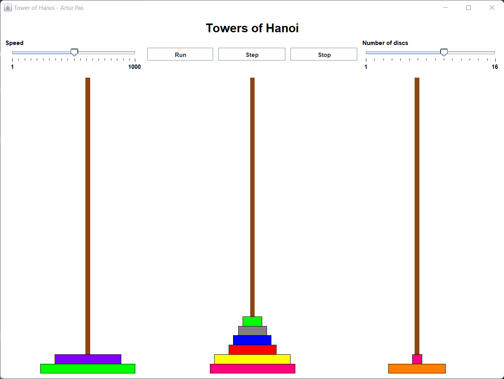

# TowerOfHanoi
Visualization of Tower of Hanoi algorithm

## Table of Contents
* [Technologies Used](#technologies-used)
* [Features](#features)
* [Project Status](#project-status)

## Technologies Used
- JDK 18.0.1.1
- Java Swing

## Features
- Visualisation of the algorithm
- Start, Step, Stop controls
- Changing number of discs
- Changing speed

## Project Status
Project is: complete
